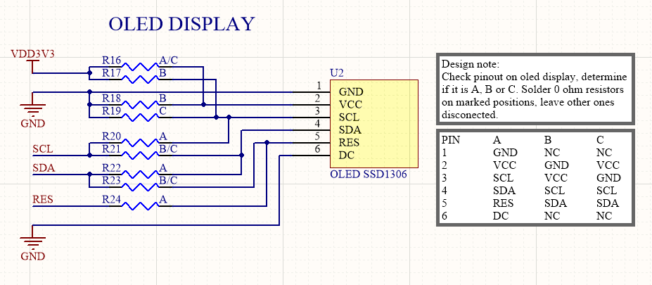

# ESP-MONITOR
## ESP8266 based current consumption and serial monitor with Grafana visualization on Raspberry 3 with Node-Red and InfluxDB integration

**ESP-MONITOR** was developed as a student project with help of **IRNAS**, Institute for development of advanced applied systems. You can learn more about them on their [website](http://www.irnas.eu) or [GitHub](https://github.com/IRNAS) page.

Part of the **ESP-MONITOR** project is also repository for Balena multicontainer setup. It can be found [here](https://github.com/SkobecSlo/ESP-MONITOR_balena_setup).
     
### Content
- [Introduction](#Introduction)
- [Preparing the development enviroment](#Preparing-development-enviroment)
- [Overview and setup of ESP-MONITOR](#Overview-and-setup-of-ESP-MONITOR)
- [Setup Raspberry Pi with Balena ](#Setup-raspberry-pi-with-Balena) 
- [Push code to Raspberry](#Push-Raspberry-with-code)
- [Create Influxdb database](#Create-Influxdb-database)
- [Setup Node-Red](#Setup-Node-Red)
- [Setup Grafana](#Setup-Grafana)
- [Resources](#Resources)

###  Introduction 
Often we want to monitor current consumption of our devices. We usually want to do this over a longer periods of time. Maybe we are unsure how some tasks will impact our current consumption and also if our devices really go into sleep mode for periods of time that we intend. At the same time we migh want to catch any serial debug data that our device outputs.

### Perfect job for ESP-MONITOR!

**ESP-MONITOR** is a device that is measuring current consumption and voltage on the device you are monitoring. At the same time it is listening for messages over UART serial connection.
When enough samples are made, we use them to calculate maximum, minimum and average values and standard deviation. 
This values and any received serial messages are then send as a **MQTT** message  to our Raspberry which with help of **Node-RED** parses and prepares our messages to save them into **Influxdb** database.
**Grafana** is then reading the database and displaying the data. 
It is possible to have several of **ESP-MONITOR** devices devices running at the same time and displaying the collected data in **Grafana**. 
That way we can see if several of our monitored devices are behaving as expected. 

###  Preparing the development environment

Download or clone the whole repository from Github.

Use command: `git clone https://github.com/SkobecSlo/ESP-MONITOR.git` in git bash. 

To compile and upload code to our ESP-MONITOR we will need [Visual Studio Code](https://code.visualstudio.com) with **PlatformIO** extension. 
**Visual Studio Code** is a source-code editor developed by Microsoft for Windows, Linux and macOS. It includes support for debugging, embedded Git control, syntax highlighting, intelligent code completion, snippets, and code refactoring.
**PlatformIO** is an open source ecosystem for IoT development. It enables you to quickly install all tools, compilers, basically everything that is needed to quickly start programming your favorite device.
After you install Visual Studio Code, you head to **Extensions** tab (found on left sidebar) and search for **PlatformIO IDE
** in Marketplace search bar. Click install and reload Visual Studio Code to enable newly added plugin. PlatformIO's logo will be added to the left sidebar. 

There are several Arduino libraries that ESP-MONITOR depends on which will have to be installed through PlatformIO. 
Go to PlatformIO -> PIO Home -> Libraries. Search and install following libraries:
- Adafruit_SSD1306 by Adafruit
- Adafruit_GFX by Adafruit
- PubSubClient by Nick O'Leary
- INA219 by DeCristofaro John (when clicked you will see by by gandy92, that is ok)

Adafruits libraries are used for interacting with OLED display over I2C, PuBSubClient is used for MQTT comunication and INA219 is used for interacting with INA219 current monitor over I2C. 

After all libraries are installed go to *File -> Add File to Workspace* and select folder ESP-MONITOR_CODE. To check if everything is ok build the code by clicking **PlatformIO: Build** button on the left side of blue bar at the bottom of Visual Studio Code. 

###  Overview and setup of ESP-MONITOR

The heart of ESP-MONITOR is Espressif ESP8266 chip running Arduino enviroment. Code is uploaded over USB connector with help of USB to Serial converter CP2102. The upload setup is similiar to the setup that is used on **NodeMcu** and official development kits boards by **Espressif**. 

#### Short description of PCB elements
**Connectors:** At the top of the board you can find RX pin on which the monitor listens for serial data, TX pin is also exposed for those that want to add extra functionality to the module for comunication with monitored device. Exposed are also 3V3 and GND as well the I2C pins. These can be used to add any extra functionality to the **ESP-MONITOR**. Finally there are also currentmonitor pins IN and OUT. Their role is described below. 

**Power supply connectors:** They are used for chaining several of **ESP-MONITORs** together so that they run from the same power supply. 

**Power indicator LED:** If **ESP-MONITOR** is connected to power supply led will be on, simple as that.  

**Reset buton:** It resets ESP12-E/F module.  

**User button:** It clears flash memory in case if user does not want to use current network which is still reachable. 

**Jumper:** Can be used to connect 3V3 or 5V to the IN pin internally, so that monitored device can function directly from **ESP-MONITOR**. Detailed explantation can be found below. 

**Indicator LEDs:** LED D1 and D2 are controled by ESP module, D1 blinks everytime when current and voltage measuremnts are sent over mqtt. RX LED is connected directly to RX pin. VIN+ LED is connected to IN pin. **WARNING!!** If using higher supply voltages than 5V on IN pin, either **desolder** VIN+ LED off the board or change current limiting resistor R3, otherwise there is gonna be some burning smell.  

#### OLED display configuration

**ESP-MONITOR** is designed in that way that you can connected three different OLED displays (that are usually found on Ebay or AliExpress) to it. The difference is ony in the setup of 0 ohm resistors that are labeled with letters A, B and C under the display. Follow the bottom instructions to determine which resistors are soldered and which ones not, depending on the version of the OLED display.

#### Serial data connection
To listen to your serial data of monitored device connect TX output from your device to the RX pin of **ESP-MONITOR**.

#### Current measuring

There are two ways to setup current measuring with **ESP-MONITOR**, either measured device is self powered or we power it from **ESP-MONITOR**.

**Self powered setup**

Power is supplied only from monitored device, before connecting IN and OUT pins first connect GND. Jumper is not connected!

**ESP-MONITOR powered setup**

**ESP-MONITOR** is supplying the power. Jumper is connected to 3V3 or 5V. To connect either of this voltages to IN line we have to enable it with Power Cycle pin in Node-Red dashboard. This will be described below.

### Uploading the code and setting the WIFI connection

1. Connect **ESP-MONITOR** with USB to computer and upload the code by clicking **PlatformIO: Upload** button on the left side of blue bar at the bottom of Visual Studio Code. 
2. **ESP-MONITOR's** display should turn on and greet you.
3. Follow instructions on the display: connect with the phone or PC to WIFI network ESP-MONITOR (password is also ESP-MONITOR).
4. Open browser and write IP address 192.168.4.1 in URL field. You will see all nearby wifi networks. Chose one which **ESP-MONITOR** and **Raspberry Pi** will use and connect to it.
5. Reset the module with RESET button, **ESP-MONITOR** should connect to the chosen network. If not, repeat the process. 
  
###  Setup Raspberry Pi with Balena

Balena is an infrastructure for developing, deploying, and managing connected devices at scale. It basically enables you to take an embedded device (or devices) with Linux OS and control or update their firmware over air. 

Steps to get Raspberry Pi running with Balena
1. Create an account on [Balena](https://www.balena.io)
2. Follow instructions on Balena's get started [web page](https://www.balena.io/docs/learn/getting-started/raspberrypi3/nodejs/) untill the start of chapter **Deploy Code**.
3. Make sure that you download the correct and latest image for Raspberry Pi 3.
4. Make sure that under Network option you check Wifi + Ethernet and that Wifi ssid and passphrase are the same as the one you used to connect **ESP-MONITOR** to.   

###  Push code to Raspberry 

Open git bash in folder of your choice and write:
1. `git clone https://github.com/SkobecSlo/ESP-MONITOR_balena_setup.git`
2. `cd ESP-MONITOR_balena_setup`
3. Go to your Balena application dashboard and click copy to clip board button and paste it into git bash

4. `git push balena master`

The last command will upload the whole repository first to the Balena servers which will compile them and then upload them to the Raspberry. In case of successfull event you will see Balena Unicorn in git bash. 

###  Create Influx database

Before continuing to our Node-Red flows, we have to setup our database in which we will be saving data into. 
Go to the application dashboard of your device and click its name. This link will take you to the dashboard of that specific device. Here you can see status of your device, if it is online, offline, updating, ect. 
After making sure that device is updated with our code click inside Terminal window a **select a target** button and select **influxdb** option. This action will make a SHH connection to our Influxdb container. Type `Influxdb` and then following command: `create database Monitor`

This will create exactly what it says. Use exactly that case sensitive name, as it is the name that **Grafana** expects. Close the connection. 

###  Setup Node-Red  

1. Enable public device URL and click blue button that will appear next to it.
2. This will take you to the **Grafana** login page, which we dont need yet.
3. In Url box of the browser delete /login from the end of URL and replace it with /node-red
4. This will take you to the configuration page of **Node-Red**
5. Username and password are **admin**
6. Locate node-red-flow.txt file in node-red-setup folder
7. Copy its content and locate in Node-Red *Menu -> Import -> Clipboard* option and paste it there.

This is a basic default flow configuration. There are some parameters that are device specific and need to be changed to work with your Raspberry Pi:
- Click one of the purple mqtt nodes in Node-Red and make sure that the IP address of the server is the same as the IP address of your device which can be found on device's Balena dashboard. Port stays 1883. Check all other purple nodes if they have correct setup.

That is it, you can now click Deploy button at top. Mqtt nodes should have green dot with connected label next to them. 

If you add to the end of public url **/node-red/ui** you will arrive at Node-Red dashboard, where you can see most recent serial output, most recent raw measurement and a Power Cycle switch which will control voltage on IN pin if jumper is connected to either 3V3 or 5V. 

###  Setup Grafana  

1. Go to your public device url now and login into Grafana with username: **admin** and password **admin**. 
2. Click *Gear icon -> Data sources* 
3. Click big icon with Monitor title and Influxdb logo.
4. All details should be filled in, scroll down and click save and test button. If everything is ok you will get conformation message.
5. Go back to main menu and click *Home* button and under general choose *Current consumption*.  

Now you are in the main dashboard that is showing all data that **ESP-MONITOR** is collecting. To make data actually appear you have to setup each one of the windows to your deviceID tag that is specific for each **ESP-MONITOR**. 
1. Click at the top of one of the windows and chose edit option. Click one of the lines under the Metrics tab and click field next to deviceID equal sign.
2. It should show you the id that is showed on OLED display of **ESP-MONITOR**, select it.
3. Do this for each line, for each graph, table in Grafana dashboard. 
4. You should see data that **ESP-MONITOR** collected.
  

#### Specific strings setup

Node-Red is already saving all serial data into InfluxDB and Grafan is already displaying them as timetable. If you want to monitor for specific string and represent it in a graph do following:
1. Navigate to Node-Red and click on Messages node
2. Here you can add specific string that you are looking for 
3. Select **contains** option and in the field write your string
4. You can add more of them by clicking add button on the bottom, this will add more outputs to the node.
5. Each output fill have to go through separate **Notification string** node before going into **Specific strings** INfluxdb node. 
6. Modify this field in each separate **Notification string** node to your liking, it can be the same as the specific stirng you are searching for. Deploy changes 
7. These fields are tags that Grafana uses to present data. 
8. Go to Grafana and create or edit existing graph.
9. Metrics tab should look something like picture below, you have to change devices id to yours and also notificationField to the string that you used in Node-Red.

###  Resources 

Here are some resources that helped me on my way of developing the project:
- [ESP-LINK](https://github.com/jeelabs/esp-link) 
- [Balena Sense](https://github.com/balena-io-playground/balena-sensehat-example)
- [Multicontainer Balena example with 8 containers](https://github.com/janvda/balena-node-red-mqtt-nginx-TIG-stack)
- [Provisioned dashboards for Grafana](https://ops.tips/blog/initialize-grafana-with-preconfigured-dashboards)
- [Andreas Spiess's video on Node-Red, Influxdb and Grafana](https://www.youtube.com/watch?v=JdV4x925au0)

